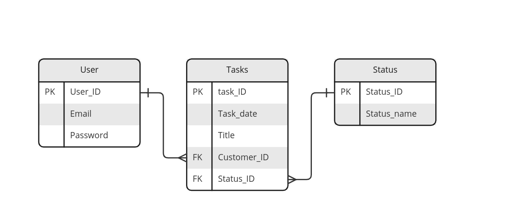

# Backend - NodeJs Coopers WebApp

Esta aplicação em NodeJs foi projetada para atender as necessidades básicas do projeto em teste técnico no processo seletivo para desenvolvedor.
A aplicação geral consiste basicamente em criação de usuário, login de usuário, criação, leitura, edição e deleção de tarefas, as "tasks".

Como o projeto não prevê conexão direta com específica estrutura de registro, aqui foi simulado um banco de dados em relação sequencial em arquivos JavaScript (src/database).

De forma simples, foram projetadas três entidades, usuários, tarefas e status(que podem ser entendidas também como categoria).

Sem entrar muito no assunto, deixarei uma ilustração apresentando os atributos e relações entre os dados.

## Estrutura

### Stacks:
A aplicação foi escrita em JavaScript com auxílio das ferramentas Eslint e Prettier, buscando agilidade nas soluções de problemas, código limpo/padronizado e possíveis crescimentos.
O framework que estrutura essa aplicação é o Express.js, escolhido por sua simplicidade e minha familiaridade.
Ainda que seja uma aplicação simples, escolhi aplicar o básico na criação e no relacionamento dos dados. Assim, faço uso da biblioteca "uuid" para garantir a cada usuário ou tarefa uma identificação única e um relacionamento fidedigno.
Escolhi a biblioteca "bcrypt" para registrar de modo seguro a senha do usuário. Junto com a senha é adicionado o salt, a ser configurado pelo administrador no arquivo .env, e feito a criptografia em 10 rodadas.
Como as tarefas são vinculadas aos usuários, vi a necessidade de entregar um token que expusesse seus dados não sensíveis de forma periódica - também configurada pelo administrador no arquivo .env - possibilitando o consumo de informações nesta aplicação de forma mais segura.
Para que a aplicação tivesse um bom funcionamento, todas as informações que passam pelas requisições são validadas antes de seguirem seu fluxo.
Pensando num modelo de resposta rápida, as validações ocorrem ao longo da requisição nos formatos de middleware. Assim, uma requisição não precisa chegar ao final para retornar um erro, caso seja a situação.
A ferramenta utilizada pra validação de informações vindas do usuário é a biblioteca "Yup", por sua fácil construção e ajustes.

### Fluxo e Arquitetura
Foi projetada para essa aplicação uma estrutura de funções realacionadas separadas em documentos de sua referência. Foi feita essa escolha por, experiência pessoal, ter maior facilidade ao identificar erros na aplicação.

Os segmentos de arquivo são:
1. Inicialização da aplicação
2. Rotas
3. Middlewares
4. Controllers
5. Services
6. Tratamento de erros
7. Interfaces
8. Banco de dados

1- Feita as configurações iniciais do servidor e o start da aplicação.

2- Construção das rotas por áreas e acionamento das funções necessárias.

3- Funções independentes que atendem diversas rotas por suas funções específicas.

4- Controladores de informação que ficará responsável por lançar a requisição correta ao service, tratará os erros e enviará a resposta ao usuário.

5- Funções específicas que farão comunicação com o banco de dados, bem como sua alteração.

6- Uma classe preparada para receber diferentes erros e retornar de forma padrão ao usuário.

7- Definições de tipos e atributos dos dados que percorrerão toda aplicação, garantindo correta leitura e emissão.

8- Arquivos simples de listas com informações, que nesta aplicação, será salva apenas em memória durante execução do servidor. Não há registro permanente.

Para rodar esta aplicação em modo de desenvolvimento, após a instalação sob o comando "npm install", rodar o comando "npm run dev".
Para rodar esta aplicação em modo de produção, após a instalação sob o comando "npm install", rodar o comando "npm run start".

